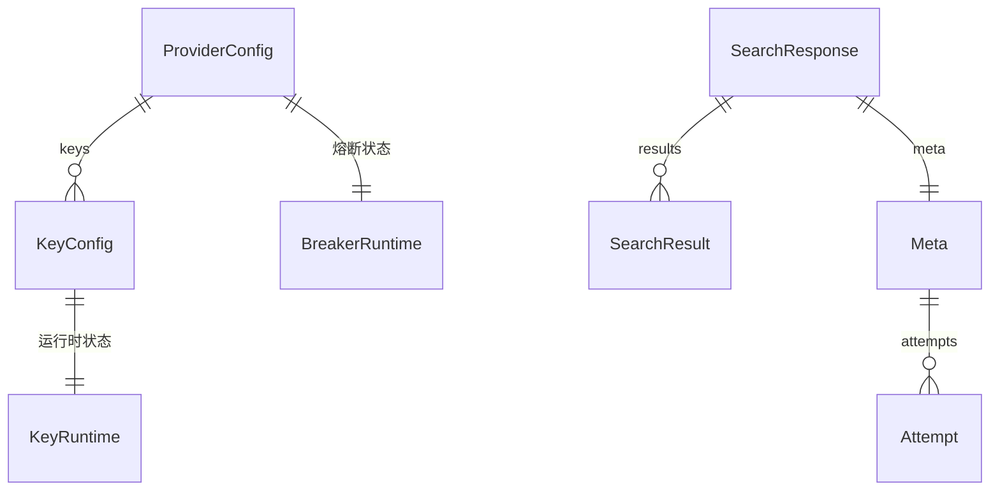

# data-model — 实体、字段、关系与约束

> v0.2 · 2026-10-06（含 design-review 修订）

三类实体：**配置实体**（静态，yaml）、**运行时实体**（内存态）、**请求/响应实体**。
统一放在 `model` 包（无环，被所有包依赖）。字段名、JSON/YAML tag 与 `api-contract.md` 一一对应。

## 配置实体（静态）

```go
package model

import "time"

type Config struct {
    Routing   RoutingConfig    `yaml:"routing"`
    Providers []ProviderConfig `yaml:"providers"`
}

type RoutingConfig struct {
    Mode string `yaml:"mode"` // "split" | "failover"，缺省 "split"
}

type ProviderConfig struct {
    ID             string        `yaml:"id"`
    Enabled        bool          `yaml:"enabled"`
    Weight         int           `yaml:"weight"`         // split 流量份额，缺省 1
    Priority       int           `yaml:"priority"`       // failover 排序，缺省 99
    Timeout        time.Duration `yaml:"timeout"`        // 上游超时，yaml 写字符串如 "10s"
    MaxKeyAttempts int           `yaml:"maxKeyAttempts"` // 同 provider 内最多尝试的 key 数（含第一个），缺省 3
    Capabilities   []string      `yaml:"capabilities"`   // 软能力（含 page）：timeRange/site/country/lang/page/safeSearch
    ContentType    string        `yaml:"contentType"`    // 硬能力："abstract" | "body"
    Keys           []KeyConfig   `yaml:"keys"`
}

type KeyConfig struct {
    ID           string `yaml:"id"`
    Label        string `yaml:"label"`
    Value        string `yaml:"value"` // API key 本体
    Enabled      bool   `yaml:"enabled"`
    QPS          int    `yaml:"qps"`        // > 0
    DailyQuota   *int   `yaml:"dailyQuota"`   // nil = 不限
    MonthlyQuota *int   `yaml:"monthlyQuota"` // nil = 不限
    TotalQuota   *int   `yaml:"totalQuota"`   // nil = 不限
}
```

> 配置语义：yaml 为主；env 仅 `SEARCH_ROUTER_CONFIG` 指定 yaml 路径（缺省 `./config.yaml`）。key 值、配额等敏感项不进 env。

## 运行时实体（内存态）

```go
type KeyState string

const (
    KeyActive      KeyState = "active"
    KeyCooling     KeyState = "cooling"
    KeyQuarantined KeyState = "quarantined"
)

type KeyRuntime struct {
    ID                  string
    State               KeyState
    Tokens              float64     // 令牌桶当前余量
    LastRefillAt        time.Time
    UsedToday           int
    UsedMonth           int
    UsedTotal           int
    DayStamp            string      // UTC 日期 "2006-01-02"
    MonthStamp          string      // UTC 月份 "2006-01"
    CooldownUntil       time.Time
    LastError           string
    LastErrorKind       ErrorKind
}

type BreakerState int

const (
    BreakerClosed BreakerState = iota
    BreakerOpen
    BreakerHalfOpen
)

type BreakerRuntime struct {
    State         BreakerState
    FailureCount  int
    OpenedAt      time.Time
    CooldownUntil time.Time
}
```

> key 状态机的完整转移见 `operation.md`（与 breaker 同级的状态图）。

## 请求 / 响应实体

```go
// Content 取值（请求偏好）
const (
    ContentAny  = "any"  // 缺省：摘要或全文都行
    ContentBody = "body" // 只要全文
)

// ContentType 取值（结果形态 + provider 硬能力）
const (
    ContentTypeAbstract = "abstract" // 摘要
    ContentTypeBody     = "body"     // 全文
)

// SafeSearch 取值（闭集）
const (
    SafeSearchOff      = "off"      // 缺省
    SafeSearchModerate = "moderate"
    SafeSearchStrict   = "strict"
)

type SearchRequest struct {
    Query      string `json:"query"`
    Content    string `json:"content,omitempty"`   // "any"(缺省) | "body"
    Site       string `json:"site,omitempty"`
    TimeRange  string `json:"timeRange,omitempty"`
    Country    string `json:"country,omitempty"`
    Lang       string `json:"lang,omitempty"`
    Page       int    `json:"page,omitempty"`
    SafeSearch string `json:"safeSearch,omitempty"` // "off" | "moderate" | "strict"
}

type SearchResult struct {
    Title         string   `json:"title"`
    URL           string   `json:"url"`           // 用于引用 / 二次取全文
    Content       string   `json:"content"`       // 正文或摘要
    ContentType   string   `json:"contentType"`   // "abstract" | "body"
    Score         *float64 `json:"score,omitempty"`         // 仅部分 provider 有，不跨 provider 归一
    PublishedDate *string  `json:"publishedDate,omitempty"`
}

type SearchResponse struct {
    Results []SearchResult `json:"results"`
    Meta    Meta           `json:"meta"`
}

type Meta struct {
    Provider      string    `json:"provider"`       // 实际回答的 provider
    KeyID         string    `json:"keyId"`          // 实际使用的 key
    TookMs        int64     `json:"tookMs"`
    Degraded      bool      `json:"degraded"`       // 是否发生降级（换过 key 或 provider）
    SwitchedFrom  string    `json:"switchedFrom,omitempty"` // 最初选中的 provider；仅当跨 provider 降级时填充
    IgnoredParams []string  `json:"ignoredParams,omitempty"` // 被忽略的软参数
    Attempts      []Attempt `json:"attempts"`
}

type Attempt struct {
    Provider string `json:"provider"`
    KeyID    string `json:"keyId,omitempty"`
    OK       bool   `json:"ok"`
    Code     string `json:"code"` // 见下方「attempt code 与 ErrorKind 的分层」
    Message  string `json:"message,omitempty"`
    TookMs   int64  `json:"tookMs"`
}

// Key 是运行时选中的 key，adapter 只用 Value 发请求
type Key struct {
    ID    string
    Label string
    Value string
}
```

### attempt code 与 ErrorKind 的分层（两层，勿混）

- **`ErrorKind`**（上游错误类别，5 个，见下）——由 adapter 抛出，供 router 决定「换 key / 换 provider / 不重试」。
- **`Attempt.Code`**（attempt 级结果码，字符串）——记录这一次 attempt 为什么结束，取值 = 5 个 `ErrorKind` 字符串 **∪** 两个**本地码**（非 `ErrorKind`，由 keypool/breaker 产生）：
  - `"no_key_available"`：keypool 无可用 key；
  - `"circuit_open"`：breaker 熔断中，请求未发出。

实现时**不要把 `no_key_available` / `circuit_open` 加进 `ErrorKind` 枚举**——它们不是上游错误，不会参与「换 key / 换 provider」的决策。

## 错误

```go
type ErrorKind string

const (
    KindKeyInvalid          ErrorKind = "keyInvalid"          // 401/403
    KindKeyRateLimited      ErrorKind = "keyRateLimited"      // 429
    KindKeyQuotaExhausted   ErrorKind = "keyQuotaExhausted"   // 配额耗尽
    KindProviderUnavailable ErrorKind = "providerUnavailable" // 5xx / 超时 / 网络错
    KindBadRequest          ErrorKind = "badRequest"          // 400 参数错
)

type ProviderError struct {
    Kind       ErrorKind
    Message    string
    RetryAfter time.Duration // 仅 keyRateLimited 用
}

func (e *ProviderError) Error() string { return string(e.Kind) + ": " + e.Message }

type AllProvidersFailedError struct {
    Attempts []Attempt
}

func (e *AllProvidersFailedError) Error() string { return "all providers failed" }
```

## 关系（ER）



## 约束

- ProviderConfig **1 — N** KeyConfig（`ProviderConfig.Keys`）
- ProviderConfig **1 — 1** BreakerRuntime
- KeyConfig **1 — 1** KeyRuntime
- `QPS > 0`；三类配额为 `nil` 表示不限；`Weight`/`Priority` 只在其对应模式下生效。
- 硬能力约束：请求 `Content == ContentBody` 时，router 排除 `ContentType() == ContentTypeAbstract` 的 provider（硬过滤，非降级）。
- 各家 `ContentType` 映射：Tavily → `"body"`；Serper / Brave → `"abstract"`。
- `Degraded` 语义：换过 key 或 provider 即为 true。`SwitchedFrom` 仅在**跨 provider** 降级时填充（= 最初选中的 provider id）；只换 key（同 provider）时 `SwitchedFrom` 留空。
