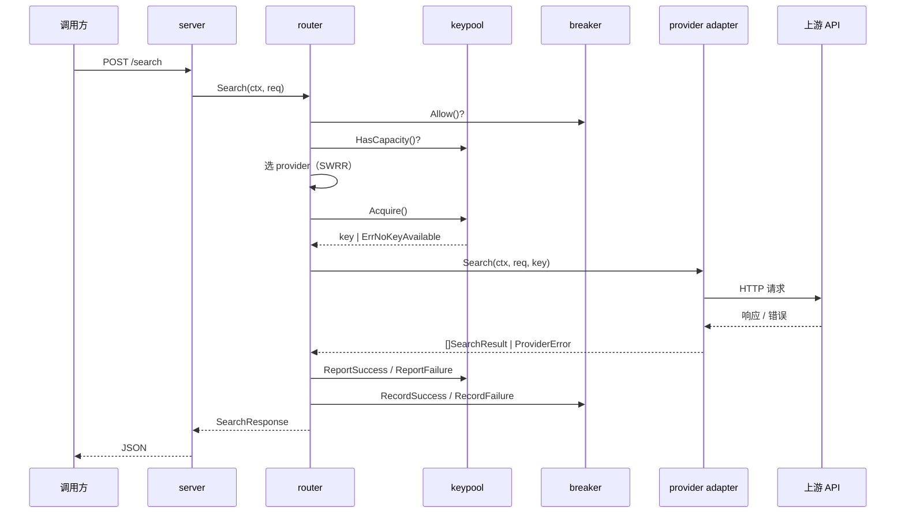

# dataflow — 数据流与状态变化

> v0.2 · 2026-10-06（含 design-review 修订）

## 1. 一个请求的生命周期（时序）



步骤说明：

1. `server` 解析 `POST /search` 为 `model.SearchRequest`。
2. `router.Search(ctx, req)` 过滤「有资格」的 provider：`breaker.Allow()` 为真 + `pool.HasCapacity()` 为真 + 满足硬能力（`req.Content == model.ContentBody` 时排除 `ContentType() == model.ContentTypeAbstract` 的 provider）。
3. `pool.Acquire()` 取 key；返回 `ErrNoKeyAvailable` → 该 provider 无可用 key。
4. `adapter.Search(ctx, req, key)` 发上游请求；provider 不支持的**软**参数被静默忽略，记入 `Meta.IgnoredParams`。
5. 成功 → `pool.ReportSuccess()` + `breaker.RecordSuccess()` + 记账，返回 `model.SearchResponse`。
6. 失败 → 按错误分类分支（见 `operation.md`）：key 故障换 key（≤`MaxKeyAttempts`），provider 故障换 provider。

## 2. 路由决策（主动分流的落点）

### 两个正交的概念

- **eligibility（资格，动态）**：provider *现在*能不能用 = 熔断未开 + 至少一个 key 有令牌、配额未满 + 满足硬能力。
  这是「主动」的来源 —— 饱和/耗尽的 provider 在**发请求之前**就掉出候选，不用等 429。
- **weight（权重，静态配置）**：在「有资格」的 provider 里，想让它分多少流量。

拆开两者，回避了最难的坑 —— 「如何把 Tavily 的月 1000 和 Serper 的总 2500 放在同一尺度比较」。
答案是：**不比**。有容量就够资格，静态权重决定份额；配额耗尽它自己出局，下月 reset 它自己回来。

### 能力过滤（硬 vs 软）

- **软能力**（可降级）：`site`/`timeRange`/`country`/`lang`/`page`/`safeSearch` —— provider 不支持就忽略该参数，照样调，记入 `Meta.IgnoredParams`。
- **硬能力**（不可降级）：`Content == model.ContentBody` —— 请求要求全文时，`ContentType() == model.ContentTypeAbstract` 的 provider 直接从候选排除（降级了就不是全文了）。

候选过滤 = 启用 + `breaker.Allow()` + `pool.HasCapacity()` + **满足硬能力**。

### 两种模式

```yaml
routing:
  mode: split | failover   # 缺省 split
```

**split（缺省）**：低并发下自然退化为「轮询 / 首选最高权重」，无副作用，故个人与产品场景可共用。

> SWRR 作用域：只对「当前有资格的 provider」加权轮询；掉出候选的 provider 不参与本轮、其累计权重保留（重新有资格时继续）。

```
每个请求：
  1. candidates = 启用 且 breaker.Allow() 且 pool.HasCapacity() 且 满足硬能力
  2. candidates 为空 → 返回 *model.AllProvidersFailedError
  3. 按 weight 用 SWRR 选一个 provider
  4. 在该 provider 内最多尝试 MaxKeyAttempts 个 key（含第一个）：
     key, err := pool.Acquire()：
       err == ErrNoKeyAvailable → 该 provider 无可用 key，跳出内层循环
     调 adapter.Search：
       成功 → 返回
       key 故障 → ReportFailure，继续内层循环（换 key）
       provider 故障 → RecordFailure，跳出内层循环
     试满 MaxKeyAttempts 个 key 仍未成功 → 跳出内层循环
  5. 从 candidates 移除该 provider，回 3（换 provider）
```

**failover**：provider 按 `priority` 排序，串行试，饱和才换下一家（= SearchHub 现状）。

> key 级故障（keyInvalid / keyRateLimited / keyQuotaExhausted）耗尽 `MaxKeyAttempts` **不触发 `breaker.RecordFailure()`**——只有 `providerUnavailable` 才记熔断。理由：全 429 是 key 的锅，不该让 provider 熔断。

## 3. 状态如何变化

| 状态 | 何时变 |
|---|---|
| `KeyRuntime.Tokens` | 随时间 refill（每秒 +QPS），每发一次 `-1` |
| `KeyRuntime.UsedToday/Month/Total` | 每次成功 `+1`；到上限 → `State = quarantined` |
| `KeyRuntime.State` | 状态机见 `operation.md`（key 状态机） |
| `BreakerRuntime.State` | 连续失败计数 / 冷却时长，见 `operation.md`（熔断状态机） |
| 配额 reset | UTC 日边界清 `UsedToday`，月边界清 `UsedMonth` |

> 吞吐说明：本进程的吞吐被上游限速卡死（例：12 key × QPS 5 ≈ 60 req/s），单进程远未到瓶颈；高并发体现在「在途请求数」而非「完成数」。这是单进程正确默认值的依据。
