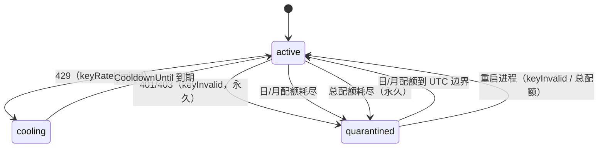
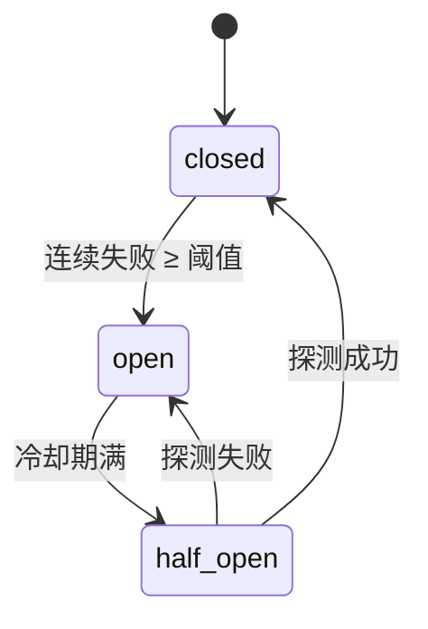

# operation — 出错处理、重试、降级

> v0.2 · 2026-10-06（含 design-review 修订）

横切于所有层：选 provider、取 key、发请求时都会碰到。这是系统「可用性」的定义。

## 错误分类（最关键的一处）

统一以 `model.ProviderError{Kind, Message, RetryAfter}` 表达，`Kind` 取值（对应 `model` 常量）：

| `Kind` 字符串 | `model` 常量 | 触发 | 处理 |
|---|---|---|---|
| `keyInvalid` | `KindKeyInvalid` | 401/403 | 隔离该 key，换 key |
| `keyRateLimited` | `KindKeyRateLimited` | 429 | 按 `RetryAfter` 冷却，换 key |
| `keyQuotaExhausted` | `KindKeyQuotaExhausted` | 配额耗尽 | 隔离到下一 reset 边界，换 key |
| `providerUnavailable` | `KindProviderUnavailable` | 5xx / 超时 / 网络错 | 熔断计数，换 provider |
| `badRequest` | `KindBadRequest` | 400 参数错 | 不重试，直接返回 |

**关键区分**：前三个是「key 的锅」→ 换 key（同 provider）；`providerUnavailable` 是「provider 的锅」→ 换 provider；`badRequest` 谁的锅都不是 → 别重试。

## 重试与降级顺序

```
换 key（同 provider，最多尝试 MaxKeyAttempts 个 key，含第一个）
  → 换 provider（split 按 weight / failover 按 priority）
    → 全部失败 → *model.AllProvidersFailedError → HTTP 502
```

`MaxKeyAttempts` 是**内层循环的上界**：同 provider 内试满 `MaxKeyAttempts` 个 key 仍失败，就升级为「换 provider」，不会无限换 key（对应 `dataflow.md` split 伪代码第 4 步）。注意：因 key 级故障（前三种 Kind）耗尽 `MaxKeyAttempts` **不触发 `breaker.RecordFailure()`**——只有 `providerUnavailable` 才记熔断。

## key 状态机



| 转移 | 触发 | 出口 |
|---|---|---|
| active → cooling | 429 | `CooldownUntil = now + RetryAfter` |
| active → quarantined | 401/403 | **永久**，无自动出口，仅重启进程清态 |
| active → quarantined | 日/月配额耗尽 | 到 UTC 日/月边界 |
| active → quarantined | 总配额耗尽 | **永久**，仅重启进程清态 |
| cooling → active | 冷却到期 | `Acquire()` 惰性刷新时恢复 |
| quarantined → active | 到达日·月边界 | 同上 |
| quarantined → active | 重启进程清态（keyInvalid / 总配额） | 内存态清零 |

> **明确**：cooling / quarantined 期间 key **不被 `Acquire()` 选中**，因此不存在「冷却期再失败」导致的 cooling→quarantined 转移。
>
> **设计决策**：401/403（keyInvalid）与总配额耗尽均视为**永久失效**——前者通常意味着 key 已吊销，定时恢复会反复打一个死 key。二者无自动出口，只能重启进程清内存态恢复（单二进制无运行时管理端点）。

## 熔断状态机



- open 期间 `Allow()` 返回 false，provider 被路由跳过（记 `Attempt{Code:"circuit_open"}`）。
- half-open 放行一次探测请求，成败决定回到 closed 还是 open。

## 配额与 reset

- 日配额：UTC 日边界清 `UsedToday`（`DayStamp` 变化时）
- 月配额：UTC 月边界清 `UsedMonth`（`MonthStamp` 变化时）
- 总配额：**不**自动恢复（手动 reset = 重启进程清内存态）
- 因**日/月**配额耗尽而 `quarantined` 的 key，到对应 UTC 日/月边界自动回到 `active`（总配额除外，永久）
- reset 是**惰性**的：在 `Acquire()`/`HasCapacity()` 时检查时间戳并刷新，不需要后台定时器

> 配额耗尽有两层：① **本地主动**——keypool 在 `refresh()` 里 `UsedX ≥ quotaX` 直接置 `quarantined`（不发请求）；② **上游被动**——adapter 把上游配额错误归类为 `keyQuotaExhausted`，router `ReportFailure` 后置 `quarantined`。两层语义一致。

## 超时

每 provider 可配 `Timeout`，由 **router** 在调用 `adapter.Search` 前用 `context.WithTimeout(ctx, ProviderConfig.Timeout)` 包裹；超时视为 `providerUnavailable`（不惩罚 key）。

## 重启 / 持久化

运行时状态为内存态，重启即清零。可选：配额计数持久化到 SQLite，避免重启后重复使用已耗尽 key（否则需等上游 429 重新学会）。多实例需 Redis，暂不做。

## Go 落地要点

- 令牌桶 / 配额的共享内存态在 `keypool` 内用 `sync.Mutex` 保护（`Acquire`/`Report*` 均加锁）。
- 取消/超时用 `context.Context` 贯穿：`server` → `router` → `adapter`。
- 配置：yaml 为主，env 仅 `SEARCH_ROUTER_CONFIG` 指定路径。

## 验收清单（任务拆分的锚点）

每条 = 行为 + 证据（单测/集成测断言）。

| # | 行为 | 证据 |
|---|---|---|
| A1 | split 模式并发下，流量按 weight 分布到有资格 provider | 单测：N 个 provider 配权重，模拟并发，断言命中次数比例 ≈ weight 比 |
| A2 | 饱和/配额耗尽的 provider 不出现在候选 | 单测：打空令牌桶 / 置满配额，断言 `HasCapacity()==false` 且路由跳过 |
| A3 | `content=body` 时排除 `contentType=abstract` 的 provider | 单测：断言候选过滤结果 |
| A4 | keyInvalid/keyRateLimited/keyQuotaExhausted → 换 key，且尝试的 key 数 ≤ MaxKeyAttempts（含第一个） | 单测：mock adapter 依次抛 3 种 key 错误，断言尝试 key 数 ≤ 上限 |
| A5 | providerUnavailable → 换 provider；badRequest → 不重试直接返回 | 单测：断言降级路径与 `Attempt` 记录 |
| A6 | 熔断：连续失败≥阈值 → open；冷却 → half-open；探测成功 → closed；探测失败 → open | 单测：驱动状态机，断言 `Allow()` |
| A7 | key 状态机：429→cooling、401/403→quarantined（永久）、日/月配额→quarantined→到边界回 active、总配额→永久、cooling 到期→active | 单测：注入可控时钟，断言状态转移 |
| A8 | 配额 reset：日/月清零、总配额不自动恢复 | 单测：跨 UTC 日/月边界断言 |
| A9 | 全部失败 → `AllProvidersFailedError` → HTTP 502；badRequest → 400 | 集成测：断言 HTTP 状态码 |
| A10 | 每个 adapter 把上游样本响应翻译成统一 `SearchResult`（contentType 正确） | 单测：每 provider 一份样本响应，断言字段映射 |
